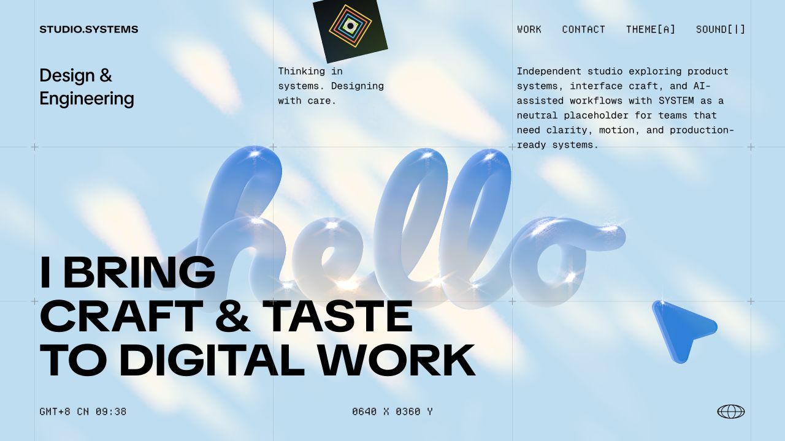

# Motion Portfolio Study

A motion-heavy portfolio study/remake inspired by [haoqi.design](https://haoqi.design/).



This repository is a learning-oriented recreation of the interaction style, transition rhythm, and visual energy of the reference website. The personal information, original project names, original profile imagery, social links, and visible author identifiers have been replaced with neutral placeholder content and generated replacement imagery.

## Reference And Attribution

- Reference website: [haoqi.design](https://haoqi.design/)
- This project is not affiliated with, endorsed by, sponsored by, or maintained by the owner of the reference website.
- The reference website, its original design, copy, code, assets, brand marks, and media remain the property of their respective rights holders.
- Attribution here is provided for transparency. It does not imply permission from the original rights holder and does not grant any license to reuse the original website's protected materials.

## Copyright And Use Notice

This repository is intended as an educational remake and technical study. Before using it in any public, commercial, or production context, replace the copied or captured runtime portions with your own implementation and verify that every font, audio file, model, image, and code dependency is licensed for your use.

The MIT license in this repository applies only to original contributions created for this remake, such as neutral placeholder copy, generated replacement images, helper scripts, and project documentation. It does not apply to third-party materials, captured runtime chunks, reference-site design expression, or any material owned by the original site or other rights holders.

If you are the rights holder of any material represented here and want a credit update, removal, or takedown, please open an issue or contact the repository owner.

## Local Preview

Run a static server from the project root:

```bash
python3 -m http.server 8766
```

Then open:

```text
http://127.0.0.1:8766/
```

## Project Structure

- `index.html` is the static SSR entry file.
- `_next/static/chunks/`, `fonts/`, `model/`, `work/`, `img/`, `sticker_img/`, and `bgm.mp3` contain the runtime and visual assets.
- `tools/generate-open-assets.py` regenerates the neutral project/sticker PNGs without pulling copyrighted Dribbble or Pinterest images into the repo.
- `app.js`, `styles.css`, and `site-data.js` are from an earlier handmade version and are not loaded by the current preview.

## Replacement Workflow

To make this safer for a real open-source release:

1. Replace captured runtime chunks with source code you wrote or have permission to publish.
2. Replace all third-party fonts, audio, and model files with assets that include redistribution rights.
3. Keep attribution to the visual reference while avoiding use of the reference site's protected media, copy, author identity, or private API keys.
4. Re-run `tools/generate-open-assets.py` whenever you want fresh neutral placeholder artwork.

## Status

Public study project. Open for educational review, remixing of original contributions, and cleanup toward a fully rights-cleared implementation.
